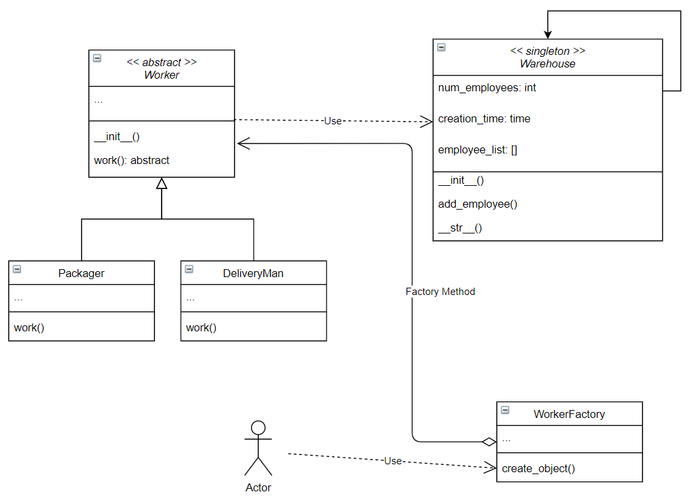

# singleton_and_factory
# Singleton and factory
Consider the following class diagram:


**Warehouse**: is a singleton class that represents a warehouse where employees work.

**Worker**: abstract class that represents employees in the warehouse

> Notice in the code that, whenever we instantiate a new Worker, a new Warehouse object is also instantiated. This would cause a problem if Warehouse wasn't a singleton.

**Packager**: subclass of *Worker*. Represents employees who work as packagers

**DeliveryMan**: subclass of *Worker*. Represents employees who work in delivery

**WorkerFactory**: A factory class for creating Worker objects.

> At any time, run the file **src/main.py** to get an interactive menu to check if your code is behaving properly. 

## Task 1
In the file *src/warehouse.py*, complete the **Warehouse** class so that it would behave as a singleton.

To test your code, run the command:
```
python src/check_1.py
```

## Task 2
In the file *src/factory_class.py*, complete the method **create_object(worker_type)** in the class **WorkerFactory** so that:
* If the parameter worker_type is equal to `"packager"`, create an instance of **Packager**
* If the parameter worker_type is equal to `"delivery"`, create an instance of **DeliveryMan**

To test your code, run the command:
```
python src/check_2.py
```

## Task 3 (practical research)
Create a singleton decorator in the file *src/decorator.py*, using a class (not nested functions or closures).
```
Hint: we recently talked about a special method called __call__, it can make an
object act as a function.
```
